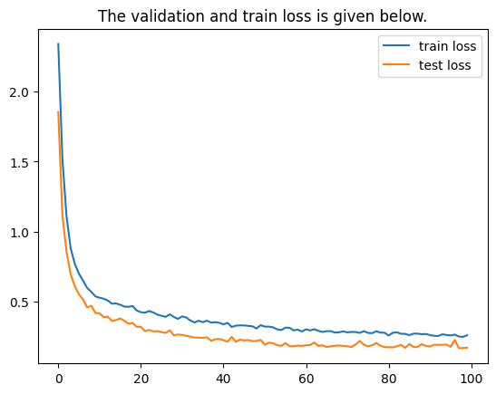

# Learning from Images: Alzheimer's Classifier


## Introduction
This repository dedicated to building and evaluating an Alzheimer's disease image classifier. The repo encompasses all steps from initial data handling to advanced model evaluation, demonstrating a complete workflow in medical image analysis using deep learning.

## Features
- Utilizes PyTorch for implementing Alzheimer classifier models
- Provides scripts for easy training and testing images.
- Command Line Interface for easy interaction.
- Includes a custom data loader for the custom Alzheimer medical image dataset.
- Incorporates data augmentation techniques to improve model robustness and generalization by artificially expanding the       training dataset with modified versions of the existing images. These modifications can include rotations, translations, flips, and more, which help the model learn from a more diverse set of data, simulating a wider range of possible input scenarios.
- Customizable training parameters for experimenting with models.

## Benchmark

<div align="center">

### Model Performance Metrics

The following table summarizes the performance metrics of our Alzheimer's Disease Image Classifier, comparing the results from the training phase to those from the testing phase. These results highlight the model's accuracy, precision, reliability, and consistency in classifying Alzheimer's disease from medical images.

| Metric     | Training Value (%) | Testing Value (%) |
|------------|--------------------|-------------------|
| Accuracy   | 97%                | 98%               |
| Precision  | 97.2%              | 98%               |
| Recall     | 97%                | 98%               |
| F1 Score   | 97.3%              | 98%               |

### Training + Testing Loss and Accuracy

<p align="center">
  
  
</p>

</div>

## Getting Started

### Detailed Installation 
| Operation No. | Description               | Command                                                    |
|---------------|---------------------------|------------------------------------------------------------|
| 1             | Cloning the Repository    | **git clone https://github.com/atikul-islam-sajib/GoodPractiseDSID.git** |
| 2             | Setting the Working Directory | **%cd /content/GoodPractiseDSID**                             |

### Prerequisites

For optimal utilization of this repository, the following prerequisites are required:

| Requirement           | Description                                                                                   |
|-----------------------|-----------------------------------------------------------------------------------------------|
| Python Version        | Python 3.9 or higher.                                                                         |
| Execution Requirements| **pip install -r requirements.txt**.                           |
| Hardware Requirement  | Access to (GPU + MPS) / CPU resources is recommended for efficient model training and evaluation. |


### Dataset link
For detailed information regarding datasets, visit the  [Dataset link](https://www.kaggle.com/datasets/farjanakabirsamanta/alzheimer-diseases-3-class/data).

### Project Structure

```
C:.
├───.github
│   └───workflows
├───alzheimer
│   ├───augmentator
│   ├───checkpoint
│   ├───classifier
│   ├───data
│   ├───experiments
│   ├───features
│   ├───figures
│   ├───models
│   ├───output
│   └───visualization
├───data
│   ├───processed
│   └───raw
├───docs
├───logs
├───model_structure
├───notebooks
├───results
├───site
│   ├───assets
│   ├───augmentation
│   ├───classifier
│   ├───contribution
│   ├───css
│   │   └───fonts
│   ├───features
│   ├───img
│   ├───installation
│   ├───js
│   ├───models
│   ├───usage
│   └───visualization
├───static
├───templates
└───tests
```


### Documentation
For detailed documentation on the implementation and usage, visit the [Alzheimer Disease Documentation](https://atikul-islam-sajib.github.io/GoodPractiseID-deploy/).

### User's Guide notebook
For detailed for training and testing model using CLI + Import Modules, visit the  [User's guide notebook - CLI + Custom Modules](https://github.com/atikul-islam-sajib/GoodPractiseDSID/blob/main/notebooks/ModelPrototyping.ipynb).

### Website


website: [Click here to access Website - Alzheimer Classifier](https://alzheimer-classifier-app.azurewebsites.net/).


## Detailed Guide - Training and testing

## CLI - Option

Examples of commands and their explanations.

```bash
python alzheimer/classifier/classifier.py --help
```

| Option | Description |
|--------|-------------|
| `--dataset <path>` | Specifies the path to the dataset. For example, `/content/dataset.zip` indicates the dataset is a zip file located in the specified directory. |
| `--batch_size <size>` | Sets the batch size for training the model. For instance, `64` indicates that 64 samples will be processed in each training batch. |
| `--model` | Indicates that a model parameter is expected, but since no specific model is detailed, this might be a placeholder for specifying the model type or architecture. |
| `--epochs <number>` | Defines the number of training cycles through the entire dataset. `500` suggests the model will be trained for 500 cycles. |
| `--lr <rate>` | Sets the learning rate for the optimizer. `0.001` is a common choice for gradually adjusting the weights in the network during training. |
| `--device <device>` | Selects the computing device for training, either `gpu` for graphical processing units or potentially `cpu` for central processing units. |
| `--augmentation <number>` | Specifies the number of augmentation samples to add to the dataset, enhancing diversity and potentially improving model robustness. `1000` implies 1000 augmented samples are added. |
| `--get_all_metrics` | Triggers the generation of all relevant metrics for evaluating the classifier's performance. This might include accuracy, precision, recall, F1 score, etc. |
| `--get_all_charts` | Initiates the creation of charts or graphs to visually represent the training process, performance metrics, or other relevant data. |


## Summary of CLI for Alzheimer's Disease Training & Testing

| Step | Command | Description |
|------|---------|-------------|
| 4. Training the Classifier | `!python alzheimer/classifier/classifier.py --dataset /content/dataset.zip --batch_size 64 --model --epochs 500 --lr 0.001 --device gpu`<br><br>**For MPS:** Replace `--device gpu` with `--device mps`. | Trains the classifier using the dataset provided, with a batch size of 64, for 500 epochs on a GPU device with a learning rate of 0.001. The command can be adapted for MPS devices as indicated. |
| 5. Training the Classifier with augmentation samples | `!python alzheimer/classifier/classifier.py --dataset /content/dataset.zip --augmentation 1000 --batch_size 64 --model --epochs 500 --lr 0.001 --device gpu`<br><br>**For MPS:** Replace `--device gpu` with `--device mps`. | Trains the classifier with the addition of 1000 augmentation samples to the dataset, using the same batch size, number of epochs, learning rate, and device as in step 4. The command supports both GPU and MPS devices. |
| 6. Generating Metrics | `!python alzheimer/classifier/classifier.py --get_all_metrics --device gpu`<br><br>**For MPS:** Replace `--device gpu` with `--device mps`. | Generates all relevant metrics for the trained classifier model, utilizing a GPU device. This can be adjusted for MPS devices accordingly. |
| 7. Creating Charts | `!python alzheimer/classifier/classifier.py --get_all_charts` | Creates charts to visually represent the metrics and performance of the classifier model. This command does not specify a device, as chart creation typically does not require GPU or MPS acceleration. |

### 8. Displaying Results

- **Image Predictions**: To view the model's predictions in a visual format, use the command:
  ```python
  Image('/content/GoodPractiseDSID/alzheimer/figures/image_prediction.png')
  ```
  
- **Training History**: To assess the model's learning curve over the training period, visualize the training history with:
  ```python
  Image('/content/GoodPractiseDSID/alzheimer/figures/training_history.png')
  ```
  
- **Confusion Metrics**: To understand the model's performance in terms of true positives, true negatives, false positives, and false negatives, display the confusion metrics:
  ```python
  Image('/content/GoodPractiseDSID/alzheimer/figures/confusion_metrics.png')
  ```

### Alzheimer's Analysis Implementation Guide - Import Custom modules

- **Import Modules**:
  ```python
  from alzheimer.data.data_loader import Dataloader
  from alzheimer.features.build_features import FeatureBuilder
  from alzheimer.models.train_model import Trainer
  from alzheimer.models.model import Classifier
  from alzheimer.visualization.visualize import ChartManager
  ```

#### 2. **Preparing the Dataset**
The first step in our analysis involves preparing the dataset for processing.

- **Unzip the Dataset**:
  ```python
  loader = Dataloader(zip_file='/content/dataset.zip')
  loader.unzip_dataset()
  ```

#### 3. **Building Features**
Once the dataset is ready, we proceed to construct features that will be used for training the model.

- **Create and Extract Features**:
  ```python
  build_features = FeatureBuilder()
  build_features.build_feature()
  loader.extract_feature()
  ```

#### 4. **Initializing the Model**
Depending on the hardware available, we will initialize our model to utilize either CUDA or MPS for GPU acceleration.

- **CUDA Initialization (For NVIDIA GPUs)**:
  ```python
  import torch
  device = torch.device('cuda' if torch.cuda.is_available() else 'cpu')
  clf = Classifier()
  model_trainer = Trainer(classifier=clf, device=device, lr=0.001)
  ```

- **MPS Initialization (For Apple Silicon GPUs)**:
  ```python
  import torch
  device = torch.device("mps") if torch.backends.mps.is_available() else torch.device("cpu")
  clf = Classifier()
  model_trainer = Trainer(classifier=clf, device=device, lr=0.001)
  ```

#### 5. **Training the Model**
With the model initialized, we can now proceed to train it with our dataset.

- **Train the Model**:
  ```python
  model_trainer.train(epochs=100, device = device)
  ```

#### 6. **Evaluating Model Performance**
After training, it's crucial to evaluate the model's performance to ensure it meets our expectations.

- **Performance Evaluation**:
  ```python
  model_evaluation, model_clf_report = model_trainer.model_performance()
  print(model_evaluation)
  print(model_clf_report)
  ```

#### 7. **Visualizing the Results**
Finally, we use the `ChartManager` to visualize the model's predictions, training history, and performance metrics.

- **Visualization**:
  ```python
  charts = ChartManager()
  charts.plot_image_predictions()
  charts.plot_training_history()
  charts.plot_confusion_metrics()
  ```
  
## Contributing
Contributions to improve the project are welcome. Please follow the standard procedures for contributing to open-source projects.

## License
This project is licensed under [MIT LICENSE](./LICENSE). Please see the LICENSE file for more details.

## Acknowledgements
Thanks to all contributors and users of the Alzheimer Classifier project. Special thanks to those who have provided feedback and suggestions for improvements.

## Contact
For any inquiries or suggestions, feel free to reach out to [atikulislamsajib137@gmail.com].

## Additional Information

- This project is a work in progress and subject to changes.
- Feedback and suggestions are highly appreciated.
- Courtesy: Atikul Islam Sajib